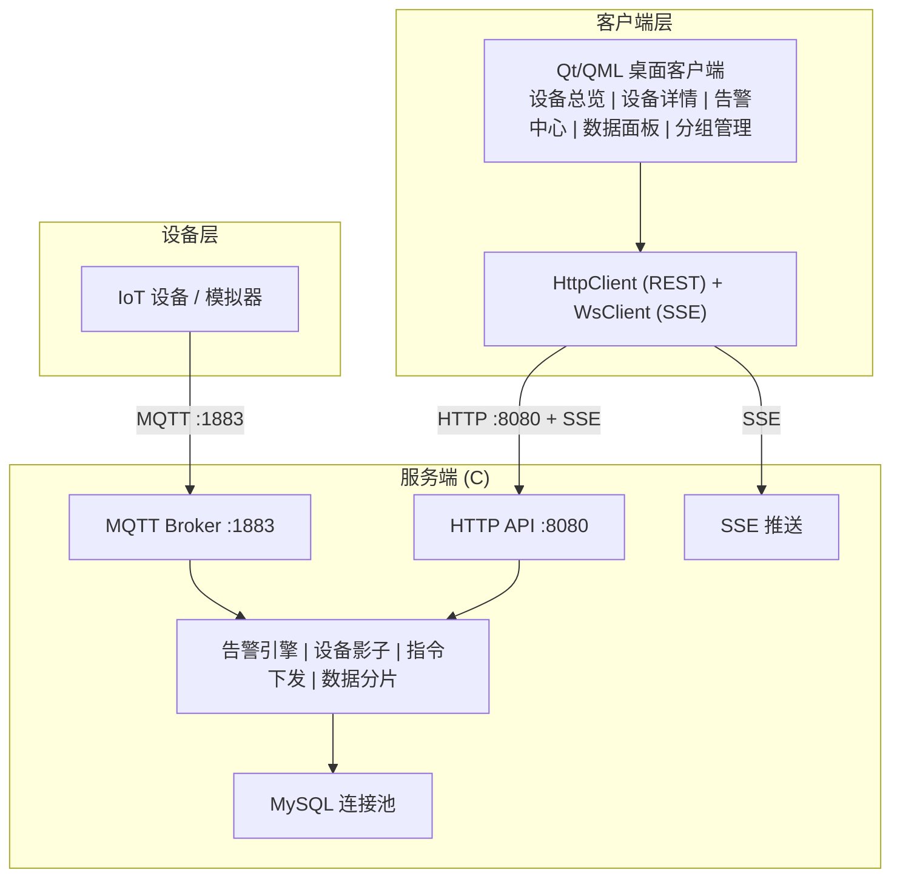
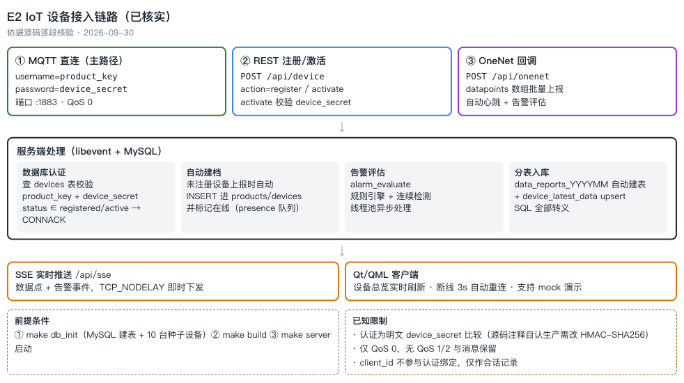

# E2 IoT 设备管理平台

简易 IoT 设备管理平台，支持设备接入、数据采集、告警管理、设备影子、指令下发。

**服务端**: C (libevent + cJSON + MySQL)  
**客户端**: Qt6 / QML  
**协议**: MQTT 3.1.1 + HTTP REST + SSE

[](https://opensource.org/licenses/MIT)
[](https://github.com)
[](https://github.com)

---

## 系统架构





---

## 功能特性

| 模块 | 功能 |
|------|------|
| **MQTT Broker** | 自定义协议解析、设备认证、数据上报、指令下发、遗嘱消息 |
| **REST API** | 设备/告警/影子/分组/指令 CRUD，action 路由模式 |
| **SSE 实时推送** | 设备数据点、告警事件实时推送到客户端 |
| **告警引擎** | 规则评估 (GT/LT/EQ/GTE/LTE)、告警记录、确认/解决流程 |
| **设备影子** | desired/reported/delta 三段式架构、批量更新、delta 计算、DB 持久化 |
| **指令下发** | 在线设备实时推送、离线设备队列缓存 |
| **数据分片** | 按月分表 (data_reports_YYYYMM)、自动建表、历史查询 |
| **设备分组** | 一级分组管理、按组查询、设备迁移 |
| **Qt 客户端** | 6 个页面、实时图表、暗色/亮色主题、SSE 自动重连 |

---

## 项目目录

```
e2-iot-device-platform/
├── src/                          # 服务端源码
│   ├── api/
│   │   ├── handlers/             # REST API 处理器
│   │   │   ├── handler_device.c  # 设备管理
│   │   │   ├── handler_alarm.c   # 告警管理
│   │   │   ├── handler_shadow.c  # 设备影子
│   │   │   ├── handler_command.c # 指令下发
│   │   │   ├── handler_group.c   # 分组管理
│   │   │   ├── handler_user.c    # 用户认证
│   │   │   └── handler_onenet.c  # OneNet 回调
│   │   ├── http_server.c         # HTTP 服务 (libevent evhttp)
│   │   ├── router.c              # REST 路由
│   │   └── auth_middleware.c     # JWT 认证中间件
│   ├── business/                 # 业务逻辑层
│   │   ├── alarm_service.c       # 告警规则 + 评估
│   │   ├── device_manager.c      # 设备管理
│   │   ├── shadow_manager.c      # 设备影子
│   │   ├── command_service.c     # 指令服务
│   │   └── group_manager.c       # 分组管理
│   ├── data/                     # 数据层
│   │   ├── db_pool.c             # MySQL 连接池
│   │   ├── data_writer.c         # 批量写入
│   │   ├── shard_router.c        # 按月分表路由
│   │   └── query_service.c       # 历史查询
│   ├── server/                   # 网络服务
│   │   ├── mqtt_broker.c         # MQTT Broker
│   │   ├── sse_handler.c         # SSE 实时推送
│   │   ├── event_loop.c          # 事件循环 (kqueue/epoll)
│   │   └── thread_pool.c         # 线程池
│   ├── mqtt/                     # MQTT 协议
│   │   ├── mqtt_parser.c         # 协议解析
│   │   ├── mqtt_codec.c          # 编解码
│   │   └── mqtt_topic.c          # Topic 匹配
│   ├── common/
│   │   ├── config.c              # 配置加载
│   │   └── log.c                 # 日志
│   └── main.c                    # 入口
│
├── include/                      # 头文件 (与 src 对应)
│
├── client/                       # Qt6 客户端
│   ├── src/
│   │   ├── main/
│   │   │   ├── main_qml.cpp      # 入口
│   │   │   └── datamanager.h/cpp # 核心管理器
│   │   ├── network/
│   │   │   ├── httpclient.h/cpp  # REST 客户端
│   │   │   └── wsclient.h/cpp    # SSE 客户端
│   │   ├── models/
│   │   │   ├── devicemodel.h     # 设备模型
│   │   │   ├── alarmmodel.h      # 告警模型
│   │   │   ├── rulemodel.h       # 规则模型
│   │   │   └── groupmodel.h      # 分组模型
│   │   └── mock/
│   │       └── mockdatasource.h  # 模拟数据源
│   ├── qml/
│   │   ├── main.qml              # 主窗口
│   │   ├── pages/                # 页面
│   │   │   ├── OverviewPage.qml  # 设备总览
│   │   │   ├── DetailPage.qml    # 设备详情
│   │   │   ├── AlarmCenterPage.qml # 告警中心
│   │   │   ├── DashboardPage.qml # 数据面板
│   │   │   ├── GroupManagePage.qml # 分组管理
│   │   │   └── GroupDetailPage.qml # 分组详情
│   │   ├── components/           # 组件
│   │   │   ├── NavSidebar.qml    # 侧边栏
│   │   │   ├── RealtimeChart.qml # 实时图表
│   │   │   ├── MetricCard.qml    # 指标卡片
│   │   │   └── ...
│   │   ├── theme/                # 主题
│   │   └── assets/               # 资源 (logo 等)
│   └── CMakeLists.txt
│
├── deploy/
│   ├── config.json               # 服务端配置
│   ├── sql/
│   │   ├── init_schema.sql       # 表结构 (DDL)
│   │   ├── init_data.sql         # 测试数据 (DML)
│   │   └── init.sql              # 入口 (调用上面两个)
│   └── scripts/
│       └── e2_report.py          # MQTT 上报测试脚本
│
├── docs/                         # 文档
│   ├── E2_技术方案文档.md
│   ├── E2_API文档.md
│   ├── E2_数据库ER图.md
│   ├── E2_MQTT协议详细设计.md
│   └── E2_架构图集.md
│
├── CMakeLists.txt                # 服务端构建
├── Makefile                      # 快捷命令
└── README.md
```

---

## 技术栈

| 层 | 技术 |
|----|------|
| **服务端语言** | C11 |
| **网络库** | libevent (evhttp + bufferevent) |
| **JSON** | cJSON |
| **数据库** | MySQL 8.0+ (Connector/C) |
| **协议** | MQTT 3.1.1 + HTTP/1.1 + SSE |
| **客户端语言** | C++17 |
| **UI 框架** | Qt 6 (QML + Qt Quick + Material) |
| **构建** | CMake 3.16+ / GNU Make |
| **脚本** | Python 3 (模拟上报) |

---

## 环境要求

### 服务端

| 依赖 | 版本 |
|------|------|
| OS | Linux / macOS |
| CMake | ≥ 3.16 |
| GCC / Clang | 支持 C11 |
| MySQL | 8.x |
| libevent | ≥ 2.1 |
| cJSON | 系统安装 |

### 客户端

| 依赖 | 版本 |
|------|------|
| Qt | 6.x (Core, Gui, Qml, Quick, QuickControls2, Charts, Network) |
| CMake | ≥ 3.16 |
| C++ 编译器 | 支持 C++17 |

---

## 快速开始

### 1. 初始化数据库

```bash
make db_init
# 输入 MySQL root 密码
```

### 2. 编译服务端

```bash
make build
# 输出: build/iot-broker
```

### 3. 启动服务端

```bash
make server
# MQTT: 1883  HTTP: 8080
```

### 4. 启动 MQTT 模拟上报

```bash
make report                      # 随机设备，2秒/条
make report-dev DEV=dev_001      # 指定设备，2秒/条
make report-fast                 # 随机设备，0.5秒/条
make report-alarm                # 触发告警（dev_001 高温）
make report-scenario             # 全流程场景测试
```

### 5. 启动 Qt 客户端

```bash
make client
# 构建并打开 IoTDeviceManager.app
```

---

## Makefile 命令

| 命令 | 作用 |
|------|------|
| `make build` | 编译服务端 |
| `make server` | 启动服务端 |
| `make client` | 编译并启动 Qt 客户端 |
| `make client-dev` | 启动 Qt 调试客户端 |
| `make db_init` | 初始化数据库 (表结构+测试数据) |
| `make db_schema` | 仅建表 (不含数据) |
| `make db_data` | 仅插入测试数据 |
| `make report` | MQTT 上报 (随机设备, 2秒/条) |
| `make report-fast` | MQTT 上报 (随机设备, 0.5秒/条) |
| `make report-dev DEV=x` | 指定设备上报 |
| `make report-alarm` | 触发告警 (dev_001 高温) |
| `make report-scenario` | 全流程场景测试 |
| `make clean` | 清理构建目录 |
| `make help` | 查看帮助 |

---

## 配置

配置文件: `deploy/config.json`（首次部署请先 `cp deploy/config.example.json deploy/config.json` 并填入真实数据库密码）

```json
{
    "mqtt_port": 1883,
    "http_port": 8080,
    "workers": 4,
    "backlog": 1024,
    "database": {
        "host": "127.0.0.1",
        "port": 3306,
        "user": "admin",
        "password": "123456",
        "database": "e2_iot",
        "pool_size": 4
    }
}
```

---

## API 概览

所有 REST API 均为 `POST /api/{module}`，通过 `action` 字段区分操作。

| 路径 | 操作 |
|------|------|
| `POST /api/user` | login |
| `POST /api/device` | activate, register, query, query_all, update, query_by_group, query_history |
| `POST /api/alarm` | query, acknowledge, resolve, add_rule, query_rules, toggle_rule, edit_rule, delete_rule |
| `POST /api/shadow` | set_desired, update, delta, (查询) |
| `POST /api/command` | (直接下发) |
| `POST /api/group` | query_all, create, update, delete |
| `GET /api/sse` | SSE 实时推送 (datapoint, alarm) |

详细文档: [docs/E2_API文档.md](docs/E2_API文档.md)

---

## 文档

| 文档 | 内容 |
|------|------|
| [技术方案文档](docs/E2_技术方案文档.md) | 系统架构、模块设计、数据流、构建运行 |
| [API 文档](docs/E2_API文档.md) | 全部 REST API 接口、SSE 推送协议 |
| [数据库 ER 图](docs/E2_数据库ER图.md) | 表结构、ER 关系、存储过程、分表策略 |
| [MQTT 协议设计](docs/E2_MQTT协议详细设计.md) | 认证、数据上报、指令下发、遗嘱消息 |
| [架构图集](docs/E2_架构图集.md) | 系统架构、数据流、模块关系、部署拓扑 |

---

## License

MIT License
