# IoT Device Platform

一个面向工业物联网场景的设备管理平台。

项目采用 **C 语言实现 MQTT Broker 核心服务**，结合 **Qt6 桌面客户端**，实现设备连接管理、消息通信、设备注册、数据管理等功能。

[](https://opensource.org/licenses/MIT)
[](https://github.com)
[](https://github.com)

## 项目架构

### 系统架构图

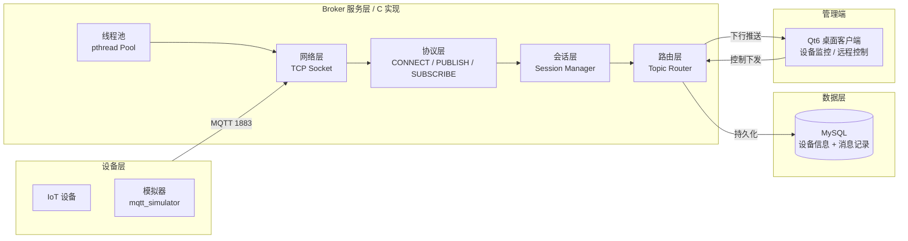

### 数据流

以一条设备上报消息为例：

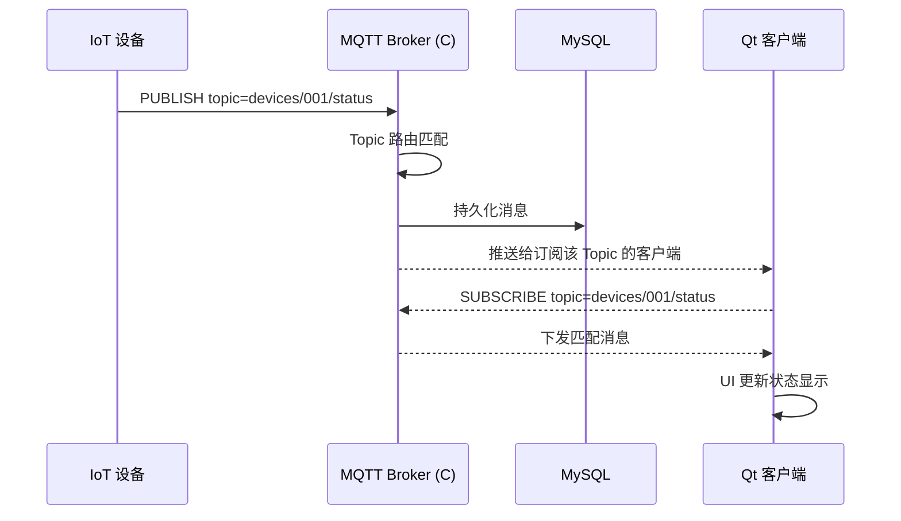

## 技术栈

### 服务端

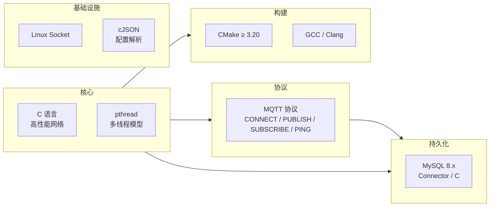

### 客户端

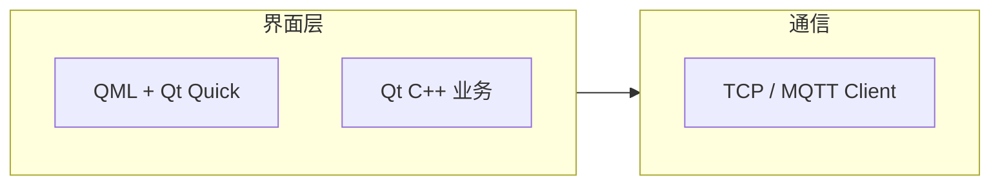

### 数据库

| 组件 | 版本 | 用途 |
| --- | --- | --- |
| MySQL | 8.x | 设备信息、消息记录、状态历史 |

## 功能特性

### MQTT Broker

| 功能 | 说明 |
| --- | --- |
| TCP 连接管理 | 支持千级客户端并发连接 |
| CONNECT / CONNACK | 设备连接与认证 |
| PUBLISH / SUBSCRIBE | 发布订阅与 Topic 路由 |
| 心跳检测 | PINGREQ / PINGRESP 保活 |
| 多客户端并发 | pthread 线程池模型 |
| 消息广播 / 单播 | 高效分发 |

### 设备管理

- 设备注册与信息维护
- 在线 / 离线状态管理
- 模拟设备接入（Python 脚本）

### 数据管理

- MySQL 持久化
- 设备信息表 / 消息记录表 / 状态记录表

### Qt 管理端

- 设备列表展示
- 实时状态监控
- 远程控制指令下发
- 数据图表 / 日志查看

## 项目目录

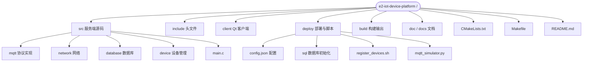

文字版目录结构：

```
e2-iot-device-platform
│
├── src/                 # Broker 源码
│   ├── mqtt/            # MQTT 协议实现
│   ├── network/         # 网络模块
│   ├── database/        # 数据库模块
│   ├── device/          # 设备管理
│   └── main.c
│
├── include/             # 头文件
│
├── client/              # Qt 客户端
│
├── deploy/
│   ├── config.json      # 服务配置
│   ├── sql/             # 数据库初始化
│   ├── register_devices.sh
│   └── mqtt_simulator.py
│
├── doc/                 # 项目文档
├── docs/                # 详细文档
├── build/               # 构建输出目录
├── CMakeLists.txt
├── Makefile
└── README.md
```

## 环境要求

### 服务端

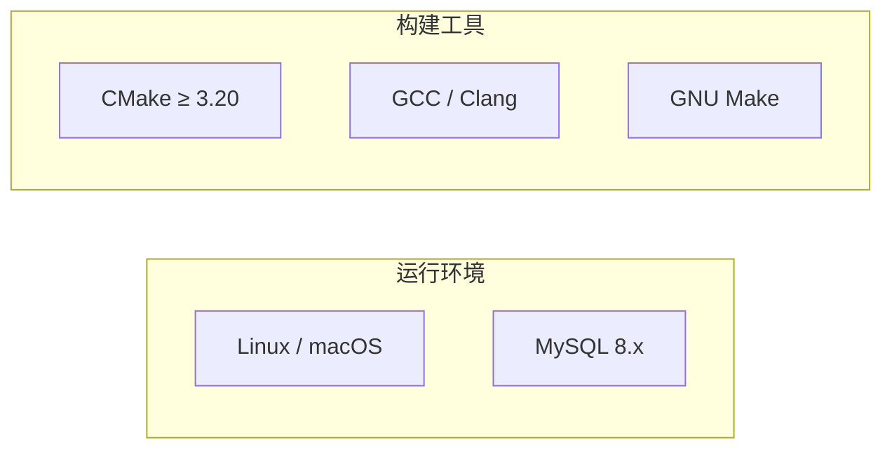

| 依赖 | 推荐版本 |
| --- | --- |
| OS | Linux / macOS |
| CMake | ≥ 3.20 |
| GCC / Clang | 支持 C11 |
| MySQL | 8.x |

### 客户端

| 依赖 | 推荐版本 |
| --- | --- |
| Qt | 6.x |
| CMake | ≥ 3.20 |
| C++ 编译器 | 支持 C++17 |

## 快速开始

### 1. 初始化数据库

```bash
make db_init
```

> 输入 MySQL root 密码。

### 2. 编译 Broker

```bash
make build
```

输出：`build/iot-broker`

### 3. 启动服务

```bash
make server
```

Console 输出：

```
MQTT Broker running...
listen port: 1883
```

### 4. 注册测试设备

```bash
make register_devices
```

### 5. 启动 MQTT 模拟器

```bash
make simulator
```

模拟多个 IoT 设备连接 Broker。

### 6. 启动 Qt 管理端

```bash
make client
```

构建并打开 `IoTDeviceManager.app`。

## 配置

配置文件路径：`deploy/config.json`

```json
{
    "mqtt_port": 1883,
    "http_port": 8080,
    "workers": 4,
    "backlog": 1024,
    "database": {
        "host": "127.0.0.1",
        "port": 3306,
        "user": "admin",
        "password": "123456",
        "database": "e2_iot",
        "pool_size": 4
    }
}
```

## 开发流程

完整的开发运行链路：

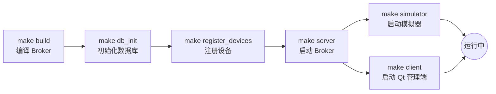

```bash
# 1. 编译
make build

# 2. 初始化数据库
make db_init

# 3. 注册设备
make register_devices

# 4. 启动 Broker（终端 1）
make server

# 5. 启动模拟设备（终端 2）
make simulator

# 6. 启动 Qt 管理端（终端 3）
make client
```

## Makefile 命令

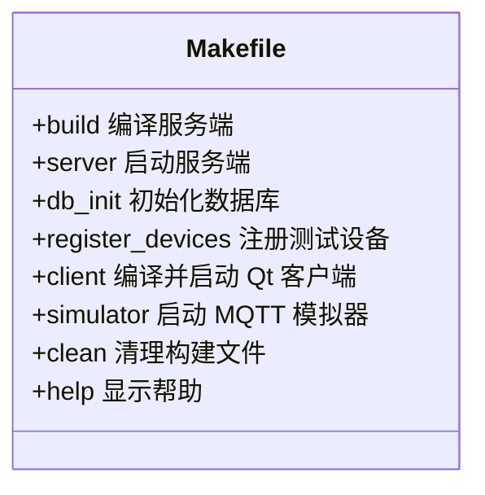

| 命令 | 作用 |
| --- | --- |
| `make build` | 编译 IoT Broker 服务端 |
| `make server` | 启动服务端 |
| `make client` | 编译并启动 Qt 客户端 |
| `make db_init` | 初始化 MySQL 数据库 |
| `make register_devices` | 注册测试设备 |
| `make simulator` | 启动 MQTT 设备模拟器 |
| `make clean` | 清理构建目录 |
| `make help` | 查看帮助 |

## 性能目标

| 指标 | 目标 |
| --- | --- |
| MQTT 并发连接 | 1000+ |
| 消息吞吐 | 万级 / 秒 |
| 在线设备数 | 千级 |
| Broker 模型 | 多线程 pthread 池 |
| 数据存储 | MySQL 持久化 |

## Roadmap

### Phase 1 · 核心协议与连接

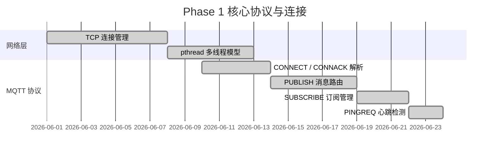

- [x] TCP 连接管理
- [x] MQTT 协议解析（CONNECT / PUBLISH / SUBSCRIBE / PING）
- [x] Client 认证与会话管理
- [x] Topic 订阅路由

### Phase 2 · 数据与客户端

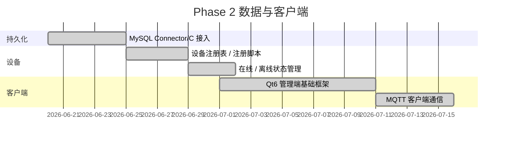

- [x] MySQL 设备管理
- [x] 设备注册
- [x] Qt 管理端基础框架

### Phase 3 · 进阶特性（规划中）

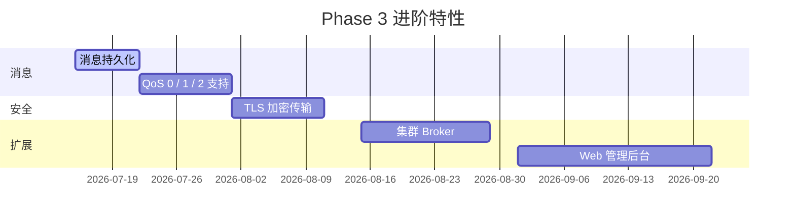

- [ ] 消息持久化
- [ ] QoS 等级支持
- [ ] TLS 加密
- [ ] 集群 Broker
- [ ] Web 管理后台

## License

MIT License
