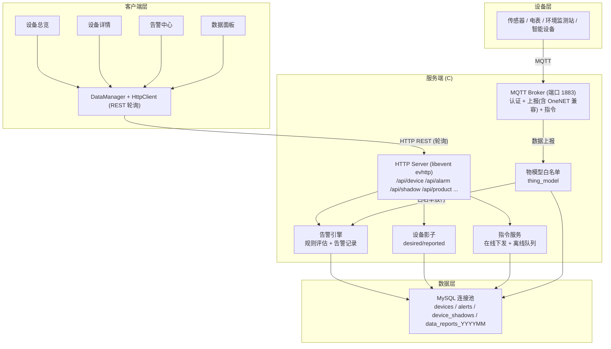
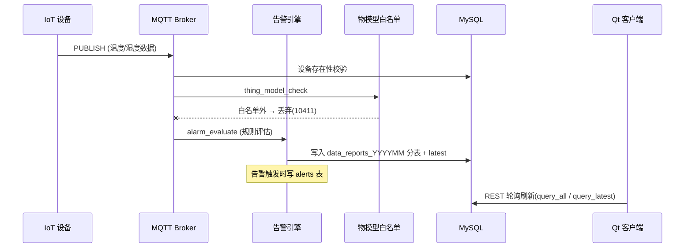
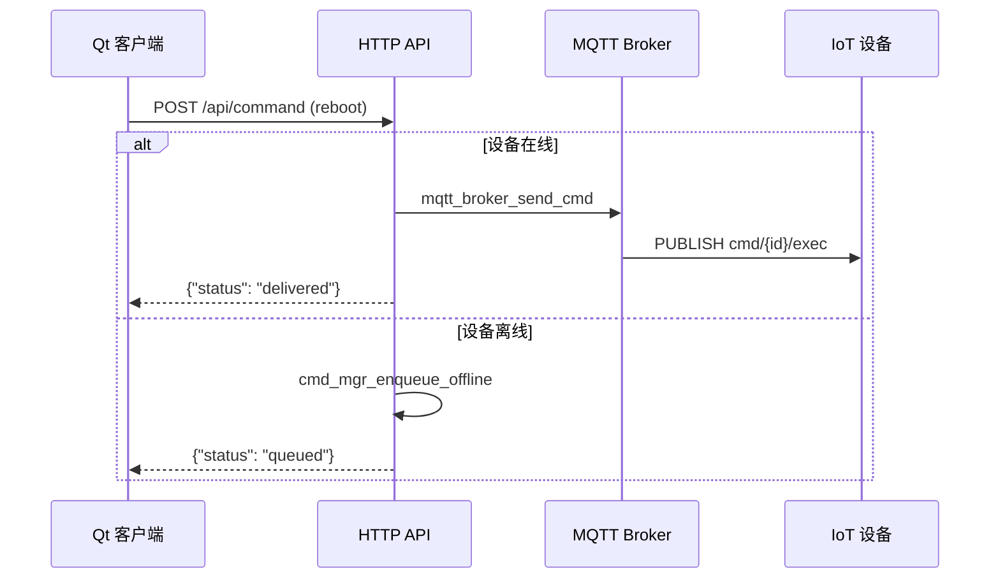

# E2 IoT 设备管理平台 — 技术方案文档

> **版本**: v2.0  
> **更新日期**: 2026-07-12  
> **技术栈**: C (服务端) + Qt/QML (客户端) + MySQL + MQTT

---

## 1. 项目概述

E2 IoT 设备管理平台是一个工业级 IoT 解决方案，支持设备接入、数据采集、告警管理、设备影子、指令下发等功能。

### 1.1 核心能力

| 能力 | 说明 |
|------|------|
| MQTT 设备接入 | 自定义 MQTT Broker，支持设备认证、数据上报、指令下发 |
| REST API | 基于 libevent evhttp，提供设备/告警/影子/分组等接口 |
| 数据实时性 | REST 轮询（客户端刷新按钮/页面查询；服务端推送通道未实现，见 KNOWN_ISSUES） |
| 告警引擎 | 规则评估 + 告警记录 + 确认/解决流程 |
| 设备影子 | desired/reported 三段式架构，支持离线同步 |
| 数据分片 | 按月分表，支持海量时序数据存储 |

---

## 2. 系统架构



---

## 3. 服务端模块

### 3.1 模块列表

| 模块 | 路径 | 职责 |
|------|------|------|
| **MQTT Broker** | `src/server/mqtt_broker.c` | MQTT 协议解析、设备认证、数据分发 |
| **HTTP Server** | `src/api/http_server.c` | libevent evhttp 服务 |
| **Router** | `src/api/router.c` | REST 路由注册与分发 |
| **Device Manager** | `src/business/device_manager.c` | 设备注册、查询、状态管理 |
| **Thing Model** | `src/business/thing_model.c` | 物模型属性白名单（校验 + 缓存 + CRUD） |
| **Alarm Service** | `src/business/alarm_service.c` | 告警规则、评估、记录 |
| **Shadow Manager** | `src/business/shadow_manager.c` | 设备影子 desired/reported |
| **Command Service** | `src/business/command_service.c` | 指令下发与队列管理 |
| **Group Manager** | `src/business/group_manager.c` | 设备分组管理 |
| **DB Pool** | `src/data/db_pool.c` | MySQL 连接池 |
| **Data Writer** | `src/data/data_writer.c` | 批量写入时序数据 |
| **Shard Router** | `src/data/shard_router.c` | 按月分表路由 |
| **Query Service** | `src/data/query_service.c` | 历史数据查询 |

### 3.2 数据流





---

## 4. REST API 接口

> **Base URL**: `http://127.0.0.1:8080/api`  
> **认证**: Bearer Token (JWT)  
> **格式**: POST JSON，通过 `action` 字段区分操作

### 4.1 认证接口

#### POST /api/user

**action: login** — 用户登录

```json
// 请求
{"action": "login", "username": "admin", "password": "admin@123"}

// 响应 200
{"token": "stub.jwt.admin", "role": "admin", "user_id": 1}

// 响应 401
{"error": "invalid credentials"}
```

### 4.2 设备管理接口

#### POST /api/device

**action: register** — 注册设备
```json
// 请求
{"action": "register", "device_id": "D001", "name": "温度传感器", "product_key": "pk_test", "device_type": "sensor", "group_id": 1}

// 响应 200
{"status": "registered"}
```

**action: query** — 查询单个设备
```json
// 请求
{"action": "query", "device_id": "D001"}

// 响应 200
{"device_id": "D001", "name": "温度传感器", "product_key": "pk_test", "online": true, "report_count": 1234, ...}
```

**action: query_all** — 查询所有设备
```json
// 请求
{"action": "query_all"}

// 响应 200
{"data": [...], "total": 10, "online_count": 7}
```

**action: update** — 更新设备信息
```json
{"action": "update", "device_id": "D001", "group_id": 2}
{"action": "update", "device_id": "D001", "name": "新名称"}
```

**action: query_by_group** — 按分组查询设备
```json
{"action": "query_by_group", "group_id": 1}
```

**action: query_history** — 查询历史数据
```json
// 请求
{"action": "query_history", "device_id": "D001", "metric": "temperature", "start_ts": 1720000000, "end_ts": 1720086400, "limit": 200}

// 响应 200
{"data": [{"ts": 1720000001, "value": 25.3}, ...], "total": 150}
```

### 4.3 告警接口

#### POST /api/alarm

**action: add_rule** — 添加告警规则
```json
{"action": "add_rule", "device_id": "D001", "metric": "temperature", "op": 0, "threshold": 35.0, "severity": 2}
// op: 0=GT, 1=LT, 2=EQ, 3=GTE, 4=LTE
// severity: 0=Info, 1=Warning, 2=Critical
```

**action: query** — 查询告警记录
```json
// 请求
{"action": "query"}

// 响应 200
{
  "data": [{
    "id": 1,
    "deviceId": "D001",
    "metric": "temperature",
    "currentValue": 36.5,
    "threshold": 35.0,
    "severity": 2,
    "status": "active",
    "acknowledged": false,
    "acknowledgedBy": 0,
    "acknowledgedAt": "",
    "resolvedBy": 0,
    "resolvedAt": "",
    "triggeredAt": 1720000000
  }]
}
```

**action: acknowledge** — 确认告警
```json
{"action": "acknowledge", "id": 1, "user_id": 1}
```

**action: resolve** — 解决告警
```json
{"action": "resolve", "id": 1, "user_id": 1}
```

**action: query_rules** — 查询告警规则
```json
{"action": "query_rules"}
```

**action: toggle_rule** — 切换规则启用状态
```json
{"action": "toggle_rule", "id": 1}
```

**action: edit_rule** — 编辑规则
```json
{"action": "edit_rule", "id": 1, "device_id": "D001", "metric": "temperature", "op": 0, "threshold": 40.0, "severity": 2}
```

**action: delete_rule** — 删除规则
```json
{"action": "delete_rule", "id": 1}
```

### 4.4 设备影子接口

#### POST /api/shadow

**action: set_desired** — 设置单个期望值
```json
{"action": "set_desired", "device_id": "D001", "key": "temperature", "value": "25"}
```

**action: update** — 批量更新期望值
```json
{"action": "update", "device_id": "D001", "desired": {"temperature": 25, "fan_speed": "high"}}
```

**action: delta** — 查询差异
```json
{"action": "delta", "device_id": "D001"}
```

**查询影子** (无 action)
```json
{"device_id": "D001"}

// 响应 200
{"device_id": "D001", "version": 3, "desired": {...}, "reported": {...}}
```

### 4.5 指令下发接口

#### POST /api/command

```json
// 请求
{"device_id": "D001", "cmd": "reboot", "payload": {"force": true}}

// 设备在线: 响应 200
{"status": "delivered"}

// 设备离线: 响应 202
{"status": "queued", "command_id": "cmd_1720000000"}
```

### 4.6 分组接口

#### POST /api/group

**action: query_all** — 查询所有分组
```json
{"action": "query_all"}
// 响应: {"data": [{"group_id": 1, "parent_id": 0, "group_name": "工厂A", "device_count": 5, ...}], "total": 9}
```

**action: create** — 创建分组
```json
{"action": "create", "group_name": "新分组", "parent_id": 0, "description": "描述"}
```

**action: update** — 更新分组
```json
{"action": "update", "group_id": 1, "group_name": "新名称", "description": "新描述"}
```

**action: delete** — 删除分组
```json
{"action": "delete", "group_id": 1}
```

### 4.7 数据实时性

**当前版本没有 SSE/WebSocket 推送通道**（早期文档的 `GET /api/sse` 从未实现，
`src/server/sse_handler.c` 不存在）。客户端刷新方式：

- 设备列表页「刷新」按钮 → `query_all`（完成后 toast 提示）
- 设备详情页 / 历史查询 → `query_latest` / `query_history`

服务端推送属计划项，见 `docs/KNOWN_ISSUES.md`。

---

## 5. MQTT 协议

### 5.1 Broker 配置

| 参数 | 值 |
|------|-----|
| 端口 | 1883 (config.json mqtt_port；启动日志打印局域网 IP) |
| 协议 | MQTT 3.1 / 3.1.1 / 5.0 (Protocol Level 3~5) |
| 认证 | 用户名/密码 (product_key/device_secret，DB 查询) |
| QoS | 0 / 1 (2 不支持) |

### 5.2 认证

MQTT CONNECT 包必须携带用户名和密码：
- **用户名**: product_key (如 `pk_test`)
- **密码**: device_secret (如 `secret_001`)

### 5.3 数据上报格式

**Topic**: `devices/{device_id}/data`

**Payload**:
```json
{
  "device_id": "D001",
  "datapoints": [
    {"metric": "temperature", "value": 25.3, "ts": 1720000001},
    {"metric": "humidity", "value": 65.0, "ts": 1720000001}
  ]
}
```

### 5.4 指令下发格式

**Topic**: `cmd/{device_id}/exec`

服务端通过 MQTT PUBLISH 下发指令到设备。

---

## 6. 客户端架构

### 6.1 技术栈

- **Qt 6** + **QML** (UI 框架)
- **QNetworkAccessManager** (HTTP 客户端)
- **QAbstractListModel** / **QAbstractTableModel** (数据模型)

### 6.2 模块列表

| 模块 | 路径 | 职责 |
|------|------|------|
| **DataManager** | `src/main/datamanager.h` | 核心管理器，连接 HttpClient 与各数据模型 |
| **HttpClient** | `src/network/httpclient.h` | REST API 客户端（轮询刷新） |
| **DeviceModel** | `src/models/devicemodel.h` | 设备数据模型 |
| **AlarmModel** | `src/models/alarmmodel.h` | 告警数据模型 |
| **RuleModel** | `src/models/rulemodel.h` | 告警规则模型 |
| **GroupModel** | `src/models/groupmodel.h` | 分组数据模型 |
| **MockDataSource** | `src/mock/mockdatasource.h` | 模拟数据源 |

### 6.3 QML 页面

| 页面 | 路径 | 功能 |
|------|------|------|
| **DevicesView** | `qml/views/DevicesView.qml` | 设备总览（统计卡 + 状态徽章 + 表格 + 注册/刷新） |
| **DeviceDetailView** | `qml/views/DeviceDetailView.qml` | 设备详情（基础信息含密钥 + 实时图表 + 告警 + 影子 + 指令 + 历史） |
| **AlarmsView** | `qml/views/AlarmsView.qml` | 告警中心（告警记录 + 告警规则） |
| **GroupsView** | `qml/views/GroupsView.qml` | 分组管理 |
| **ProductsView** | `qml/views/ProductsView.qml` | 产品管理（CRUD） |
| **MqttGuideView** | `qml/views/MqttGuideView.qml` | MQTT 接入指南（设备行「接入」进入，凭证/IP 自动填充） |

### 6.4 数据流

```
用户操作 → QML → DataManager → HttpClient → REST API → 服务端
设备数据 → MQTT → 白名单校验 → 落库/告警 → 客户端轮询获取 → QML 更新
```

---

## 7. 配置文件

### 7.1 config.json

```json
{
    "mqtt_port": 1883,
    "http_port": 8080,
    "workers": 4,
    "backlog": 1024,
    "database": {
        "host": "127.0.0.1",
        "port": 3306,
        "user": "admin",
        "password": "123456",
        "database": "e2_iot",
        "pool_size": 4
    }
}
```

---

## 8. 构建与运行

### 8.1 依赖

**服务端**:
- libevent
- cJSON
- MySQL client library
- pthread

**客户端**:
- Qt 6 (Core, Gui, Qml, Quick, QuickControls2, Charts, Network)
- CMake 3.16+

### 8.2 构建命令

```bash
# 服务端
make build

# 客户端
cd client && cmake -B build && cmake --build build
```

### 8.3 运行命令

```bash
make server              # 启动服务端
make client              # 编译并启动客户端
make report              # MQTT 模拟上报 (2秒/条)
make report-dev DEV=x    # 指定设备上报
make db_init             # 初始化数据库
make help                # 查看所有命令
```
