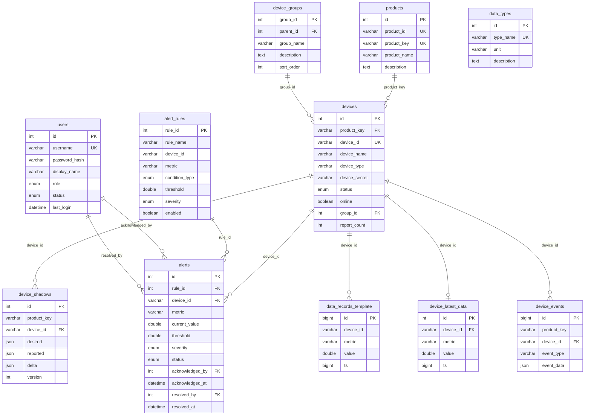

# E2 — 数据库设计文档

> **版本**: v2.0  
> **更新日期**: 2026-07-12  
> **数据库**: MySQL 8.0+ / InnoDB / utf8mb4  
> **库名**: `e2_iot`

---

## 1. ER 图



---

## 2. 表结构详细说明

### 2.1 users — 用户表

| 字段 | 类型 | 约束 | 说明 |
|------|------|------|------|
| id | INT | PK, AUTO_INCREMENT | 用户 ID |
| username | VARCHAR(64) | NOT NULL, UNIQUE | 用户名 |
| password_hash | VARCHAR(255) | NOT NULL | 密码哈希 (SHA2) |
| display_name | VARCHAR(128) | | 显示名称 |
| role | ENUM | DEFAULT 'user' | 角色: admin/user/viewer |
| status | ENUM | DEFAULT 'active' | 状态: active/disabled |
| last_login | DATETIME | | 最后登录时间 |
| created_at | DATETIME | DEFAULT NOW() | 创建时间 |
| updated_at | DATETIME | ON UPDATE NOW() | 更新时间 |

**默认数据**:
```sql
INSERT INTO users (username, password_hash, display_name, role, status)
VALUES ('admin', SHA2('admin@123', 256), '系统管理员', 'admin', 'active');
```

### 2.2 products — 产品表

| 字段 | 类型 | 约束 | 说明 |
|------|------|------|------|
| id | INT | PK, AUTO_INCREMENT | 产品 ID |
| product_id | VARCHAR(64) | NOT NULL, UNIQUE | 产品编号 |
| product_key | VARCHAR(64) | NOT NULL, UNIQUE | 产品密钥 (MQTT 认证) |
| product_name | VARCHAR(128) | | 产品名称 |
| description | TEXT | | 描述 |
| created_at | DATETIME | DEFAULT NOW() | 创建时间 |

**默认数据**:
```sql
INSERT INTO products (product_id, product_key, product_name) VALUES
('PROD001', 'factory_sensor', '工厂传感器'),
('PROD002', 'smart_meter', '智能电表'),
('PROD003', 'env_monitor', '环境监测站');
```

### 2.3 device_groups — 设备分组表（仅一级，无层级）

| 字段 | 类型 | 约束 | 说明 |
|------|------|------|------|
| group_id | INT | PK, AUTO_INCREMENT | 分组 ID |
| parent_id | INT | FK → device_groups(group_id) | 父分组 ID |
| group_name | VARCHAR(128) | NOT NULL | 分组名称 |
| description | TEXT | | 描述 |
| sort_order | INT | DEFAULT 0 | 排序序号 |
| created_at | DATETIME | DEFAULT NOW() | 创建时间 |

### 2.4 devices — 设备表

| 字段 | 类型 | 约束 | 说明 |
|------|------|------|------|
| id | INT | PK, AUTO_INCREMENT | 自增 ID |
| product_key | VARCHAR(64) | NOT NULL, FK → products | 产品密钥 |
| device_id | VARCHAR(64) | NOT NULL, UNIQUE | 设备 ID |
| device_name | VARCHAR(128) | | 设备名称 |
| device_type | VARCHAR(64) | | 设备类型 |
| device_secret | VARCHAR(512) | | 设备密钥 |
| status | ENUM | DEFAULT 'registered' | 状态: registered/active/disabled/decommissioned |
| online | BOOLEAN | DEFAULT FALSE | 是否在线 |
| last_online | DATETIME | | 最后在线时间 |
| group_id | INT | FK → device_groups | 所属分组 |
| report_count | INT | DEFAULT 0 | 上报次数 |
| created_at | DATETIME | DEFAULT NOW() | 创建时间 |
| updated_at | DATETIME | ON UPDATE NOW() | 更新时间 |

### 2.5 device_shadows — 设备影子表

| 字段 | 类型 | 约束 | 说明 |
|------|------|------|------|
| id | INT | PK, AUTO_INCREMENT | 自增 ID |
| product_key | VARCHAR(64) | NOT NULL | 产品密钥 |
| device_id | VARCHAR(64) | NOT NULL, FK → devices | 设备 ID |
| desired | JSON | | 期望状态 |
| reported | JSON | | 报告状态 |
| delta | JSON | | 差异 |
| version | INT | DEFAULT 1 | 版本号 |
| updated_at | DATETIME | ON UPDATE NOW() | 更新时间 |

**UNIQUE KEY**: (product_key, device_id)

### 2.6 alert_rules — 告警规则表

| 字段 | 类型 | 约束 | 说明 |
|------|------|------|------|
| rule_id | INT | PK, AUTO_INCREMENT | 规则 ID |
| rule_name | VARCHAR(128) | NOT NULL | 规则名称 |
| product_key | VARCHAR(64) | | 产品密钥 |
| device_id | VARCHAR(64) | | 设备 ID (为空则全局) |
| metric | VARCHAR(64) | NOT NULL | 监控指标 |
| condition_type | ENUM | NOT NULL | 条件: gt/lt/eq/ne/gte/lte |
| threshold | DOUBLE | NOT NULL | 阈值 |
| severity | ENUM | DEFAULT 'warning' | 级别: info/warning/critical |
| enabled | BOOLEAN | DEFAULT TRUE | 是否启用 |
| created_at | DATETIME | DEFAULT NOW() | 创建时间 |

### 2.7 alerts — 告警记录表

| 字段 | 类型 | 约束 | 说明 |
|------|------|------|------|
| id | INT | PK, AUTO_INCREMENT | 告警 ID |
| rule_id | INT | FK → alert_rules | 触发的规则 |
| device_id | VARCHAR(64) | NOT NULL, FK → devices | 设备 ID |
| metric | VARCHAR(64) | NOT NULL | 指标名 |
| current_value | DOUBLE | | 当前值 |
| threshold | DOUBLE | | 阈值 |
| severity | ENUM | DEFAULT 'warning' | 级别 |
| status | ENUM | DEFAULT 'active' | 状态: active/acknowledged/resolved |
| acknowledged_by | INT | FK → users | 确认人 |
| acknowledged_at | DATETIME | | 确认时间 |
| resolved_by | INT | FK → users | 解决人 |
| resolved_at | DATETIME | | 解决时间 |
| created_at | DATETIME | DEFAULT NOW() | 创建时间 |

### 2.8 data_records_template — 数据记录表模板 (按月分表)

| 字段 | 类型 | 约束 | 说明 |
|------|------|------|------|
| id | BIGINT | PK, AUTO_INCREMENT | 自增 ID |
| device_id | VARCHAR(64) | NOT NULL | 设备 ID |
| metric | VARCHAR(64) | NOT NULL | 指标名 |
| value | DOUBLE | | 值 |
| ts | BIGINT | NOT NULL | 时间戳 (Unix) |
| created_at | DATETIME | DEFAULT NOW() | 创建时间 |

**分表命名**: `data_reports_YYYYMM` (如 `data_reports_202607`)

### 2.9 device_latest_data — 设备最新数据表

| 字段 | 类型 | 约束 | 说明 |
|------|------|------|------|
| id | INT | PK, AUTO_INCREMENT | 自增 ID |
| device_id | VARCHAR(64) | NOT NULL, FK → devices | 设备 ID |
| metric | VARCHAR(64) | NOT NULL | 指标名 |
| value | DOUBLE | | 最新值 |
| ts | BIGINT | | 时间戳 |
| updated_at | DATETIME | ON UPDATE NOW() | 更新时间 |

**UNIQUE KEY**: (device_id, metric)

### 2.10 device_events — 设备事件表

| 字段 | 类型 | 约束 | 说明 |
|------|------|------|------|
| id | BIGINT | PK, AUTO_INCREMENT | 自增 ID |
| product_key | VARCHAR(64) | NOT NULL | 产品密钥 |
| device_id | VARCHAR(64) | NOT NULL, FK → devices | 设备 ID |
| event_type | VARCHAR(64) | NOT NULL | 事件类型 |
| event_data | JSON | | 事件数据 |
| created_at | DATETIME | DEFAULT NOW() | 创建时间 |

### 2.11 product_properties — 物模型属性白名单（2026-10-06 新增）

产品级上报属性白名单，约束设备允许上报的 metric（详见 MQTT 协议文档 §3.3）。

| 字段 | 类型 | 约束 | 说明 |
|------|------|------|------|
| id | INT | PK, AUTO_INCREMENT | 自增 ID |
| product_key | VARCHAR(64) | NOT NULL, UNIQUE(与 identifier 联合) | 产品密钥 |
| identifier | VARCHAR(64) | NOT NULL | 属性标识（metric 名） |
| prop_type | ENUM | NOT NULL, DEFAULT 'number' | number / bool / string |
| description | VARCHAR(255) | DEFAULT '' | 描述 |
| created_at | DATETIME | DEFAULT CURRENT_TIMESTAMP | 创建时间 |

**语义**：产品在本表**无任何记录 = 自由模式**（上报全放行）；
有记录后，白名单外 identifier 拒绝入库，bool 类型值要求 0/1。
服务端启动时自动建表（幂等），也可手动执行
`deploy/sql/migrations/2026-10-06_product_properties.sql`。
配置入口：`POST /api/product` 的 `prop_add` / `prop_del` / `prop_list`。

---

## 3. 存储过程

### 3.1 sp_ensure_shard_tables — 确保分表存在

自动创建当月和下月的分表：

```sql
CALL sp_ensure_shard_tables();
-- 输出: Tables ensured: data_reports_202607, data_reports_202608
```

### 3.2 sp_batch_register_devices — 批量注册设备

```sql
CALL sp_batch_register_devices('pk_test', 'sensor', 1, 10);
-- 输出: 10 devices registered
```

---

## 4. 视图

### 4.1 v_device_stats — 设备统计

```sql
SELECT * FROM v_device_stats;
```

| 字段 | 说明 |
|------|------|
| product_key | 产品密钥 |
| total_devices | 设备总数 |
| online_devices | 在线数 |
| offline_devices | 离线数 |
| online_rate | 在线率 (%) |
| latest_activity | 最新活动时间 |

---

## 5. 分表策略

- **分表依据**: 按月分表，表名格式 `data_YYYYMM`
- **路由逻辑**: 根据数据时间戳计算表名
- **自动建表**: 存储过程 `sp_ensure_shard_tables` 自动创建当月+下月分表
- **清理策略**: 直接 `DROP TABLE data_YYYYMM` 清理历史数据

---

## 6. 初始化

```bash
# 执行初始化脚本
mysql -u root -p < deploy/sql/init.sql

# 或通过 Makefile
make db_init
```
