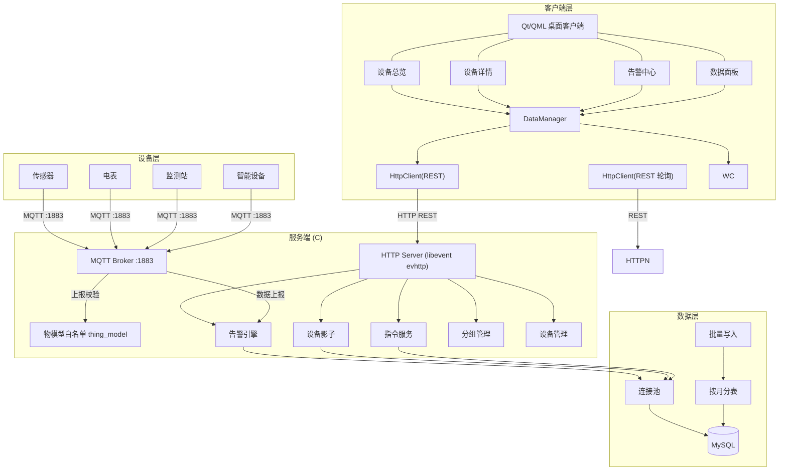
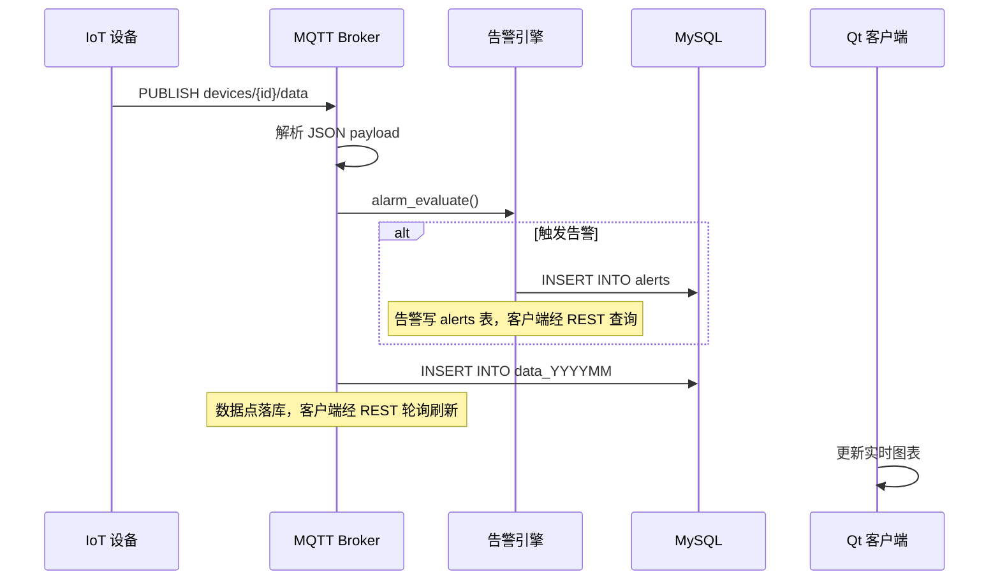
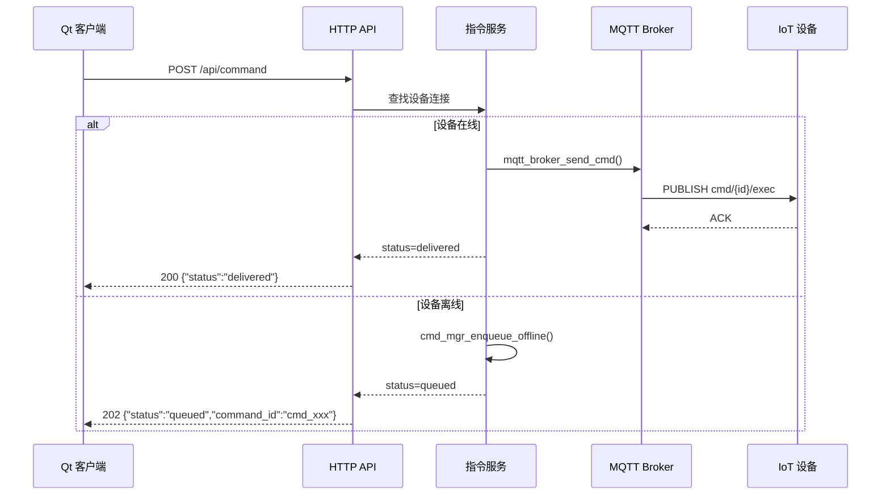
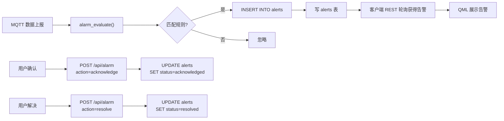
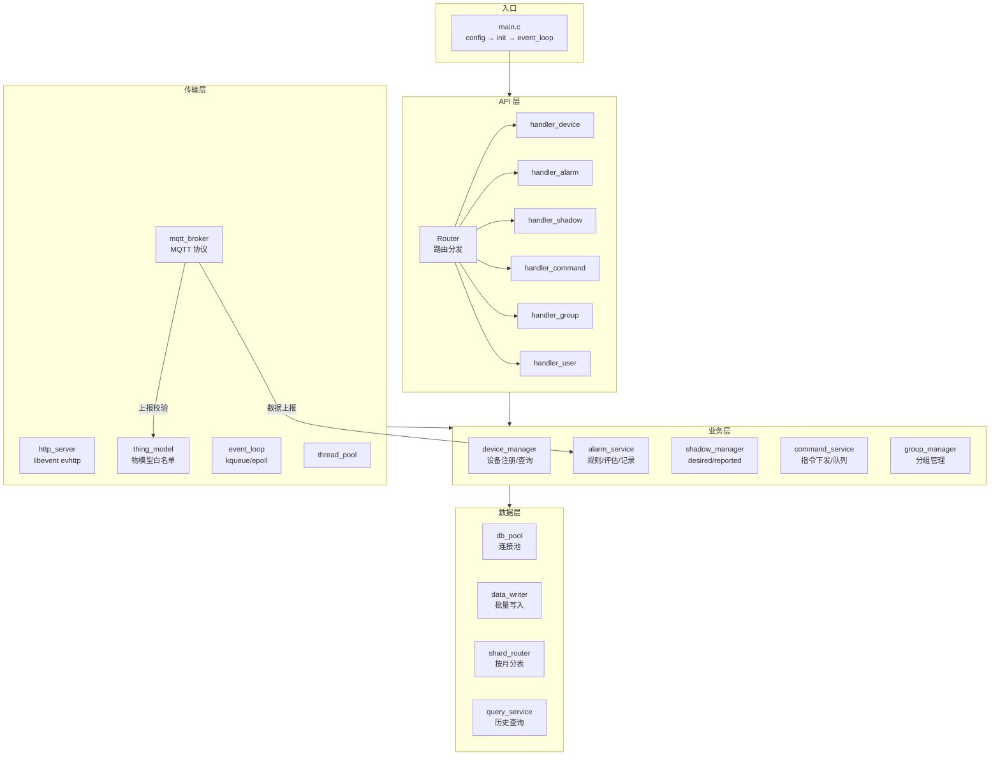
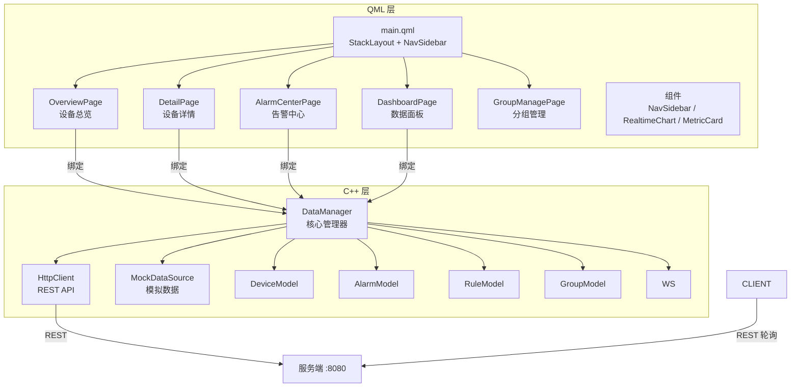
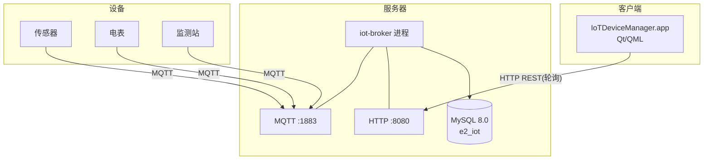
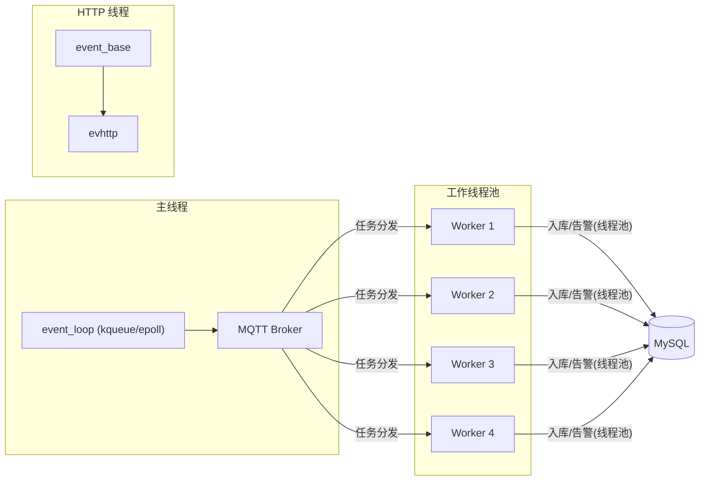

# E2 — 架构图集

> **版本**: v2.0  
> **更新日期**: 2026-07-12

---

## 1. 系统总体架构

---

## 2. 数据流 — 设备上报

---

## 3. 数据流 — 指令下发

---

## 4. 数据流 — 告警处理

---

## 5. 服务端模块架构

---

## 6. 客户端架构

---

## 7. 部署架构

---

## 8. 端口与协议

| 端口 | 协议 | 用途 |
|------|------|------|
| 1883 | MQTT | 设备接入、数据上报、指令下发 |
| 8080 | HTTP | REST API |

---

## 9. 线程模型

