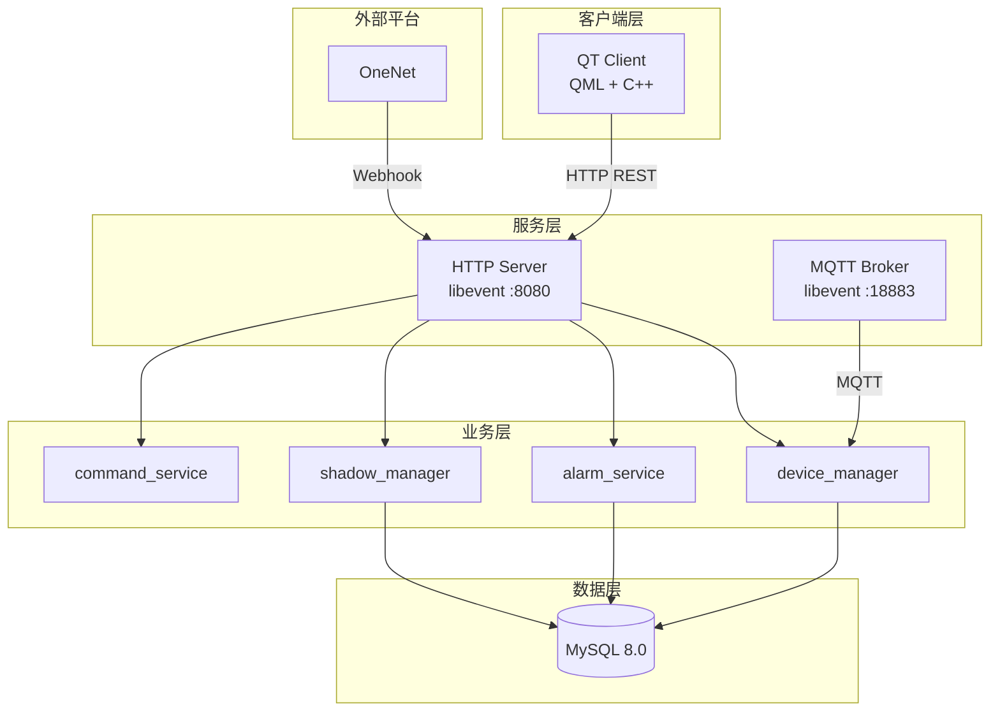
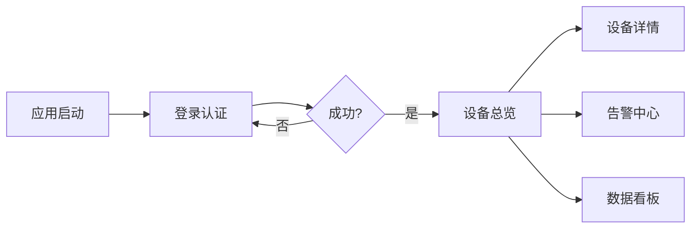
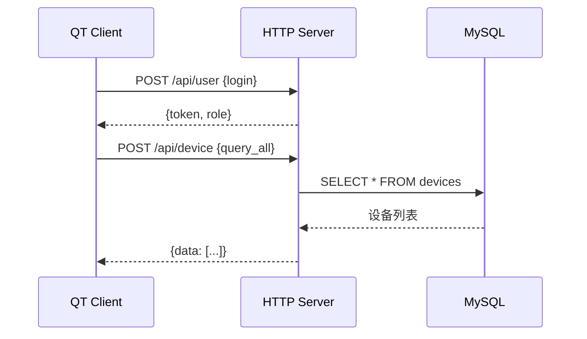
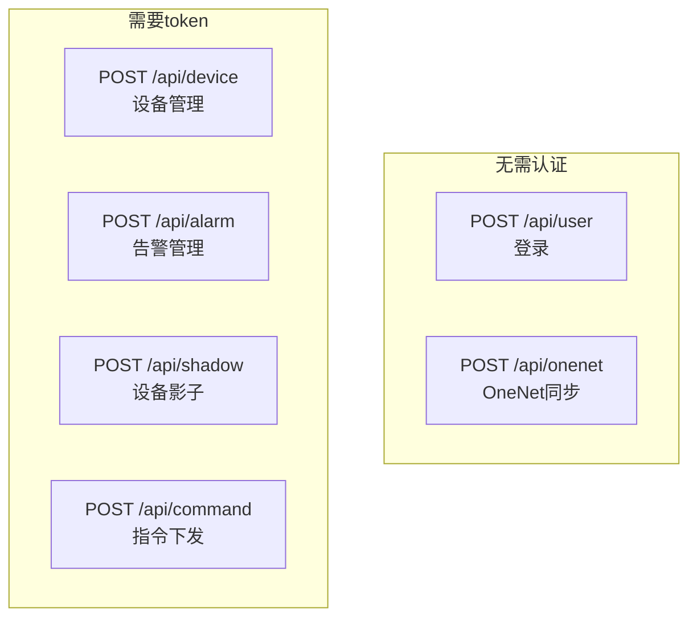
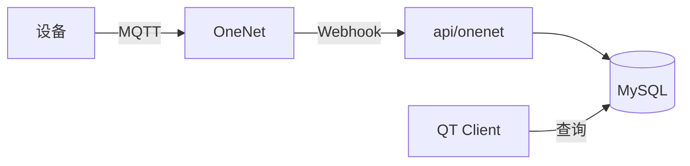
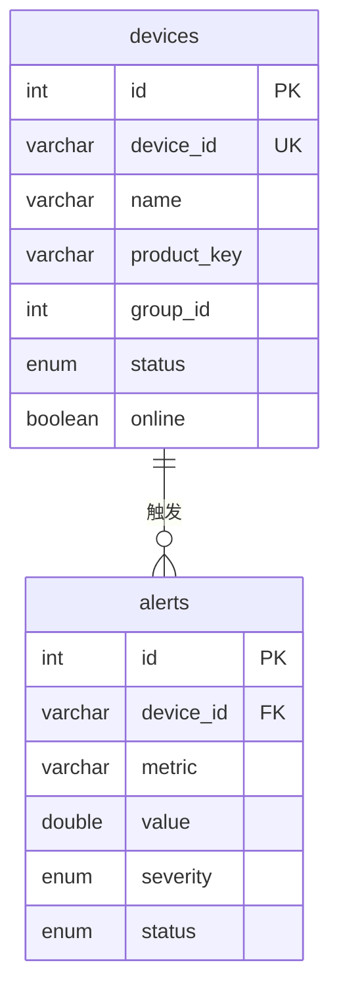

# E2 IoT 平台架构图

## 1. 系统整体架构

```mermaid
graph TB
    subgraph Client["客户端层"]
        A[QT Client<br/>QML + C++]
    end
    
    subgraph Server["服务层"]
        B[HTTP Server<br/>libevent :8080]
        C[MQTT Broker<br/>libevent :18883]
    end
    
    subgraph Business["业务层"]
        D[device_manager]
        E[alarm_service]
        F[shadow_manager]
        G[command_service]
    end
    
    subgraph Data["数据层"]
        H[(MySQL 8.0)]
    end
    
    subgraph External["外部平台"]
        I[OneNet]
    end
    
    A -->|HTTP REST| B
    B --> D
    B --> E
    B --> F
    B --> G
    C -->|MQTT| D
    D --> H
    E --> H
    F --> H
    I -->|Webhook| B
```

## 2. 客户端页面流程

```mermaid
graph LR
    A[应用启动] --> B[登录认证]
    B --> C{成功?}
    C -->|是| D[设备总览]
    C -->|否| B
    
    D --> E[设备详情]
    D --> F[告警中心]
    D --> G[数据看板]
```

## 3. 登录与数据获取流程

```mermaid
sequenceDiagram
    participant QT as QT Client
    participant API as HTTP Server
    participant DB as MySQL
    
    QT->>API: POST /api/user {login}
    API-->>QT: {token, role}
    
    QT->>API: POST /api/device {query_all}
    API->>DB: SELECT * FROM devices
    DB-->>API: 设备列表
    API-->>QT: {data: [...]}
```

## 4. API接口总览

```mermaid
graph TD
    subgraph NoAuth["无需认证"]
        A[POST /api/user<br/>登录]
        B[POST /api/onenet<br/>OneNet同步]
    end
    
    subgraph Auth["需要token"]
        C[POST /api/device<br/>设备管理]
        D[POST /api/alarm<br/>告警管理]
        E[POST /api/shadow<br/>设备影子]
        F[POST /api/command<br/>指令下发]
    end
```

## 5. OneNet对接流程

```mermaid
graph LR
    A[设备] -->|MQTT| B[OneNet]
    B -->|Webhook| C[api/onenet]
    C --> D[(MySQL)]
    E[QT Client] -->|查询| D
```

## 6. 数据库ER图

```mermaid
erDiagram
    devices {
        int id PK
        varchar device_id UK
        varchar name
        varchar product_key
        int group_id
        enum status
        boolean online
    }
    
    alerts {
        int id PK
        varchar device_id FK
        varchar metric
        double value
        enum severity
        enum status
    }
    
    devices ||--o{ alerts : "触发"
```
